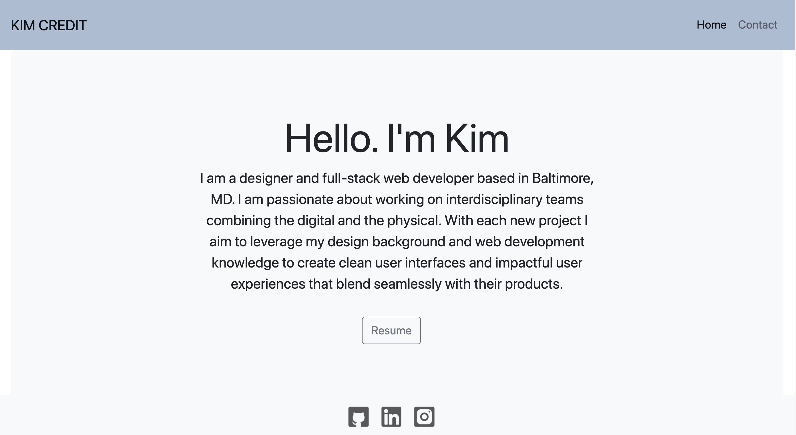

# React Portfolio
See examples of my work.

<kbd>

</kbd>

## Credits
The starter code of this application was provided by Trilogy Education Services for the JHU Web Development Bootcamp. It uses
[Express](https://www.npmjs.com/package/express), [Node](https://nodejs.org/en/), [MongoDB](https://www.mongodb.com/), [Mongoose](https://www.npmjs.com/package/mongoose/), and [Compress](https://www.npmjs.com/package/compression).

## Credits
This MERN application uses [MongoDB](https://www.mongodb.com/), [Mongoose](https://www.npmjs.com/package/mongoose/), [Express](https://www.npmjs.com/package/express), [React](https://reactjs.org/),  and [Node](https://nodejs.org/en/.
 
Styling relies on [Bootstrap] (https://getbootstrap.com/).

## Other Work
You can see some of my other work at <https://github.com/kimcredit>.    

## License
Copyright (c) 2020 Kim Credit.
